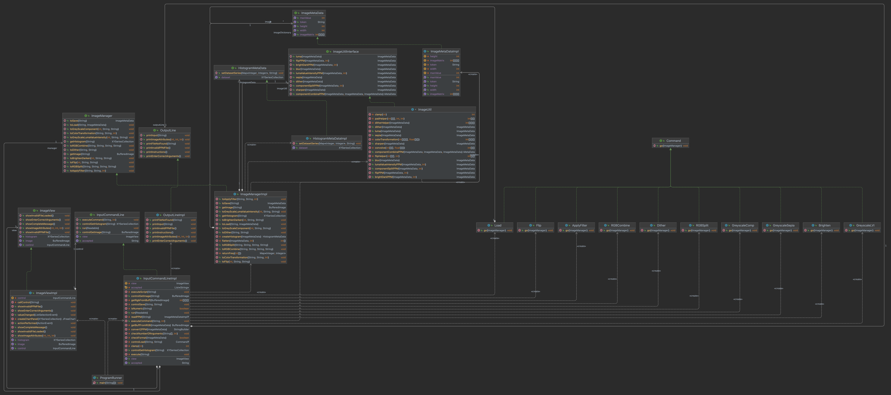
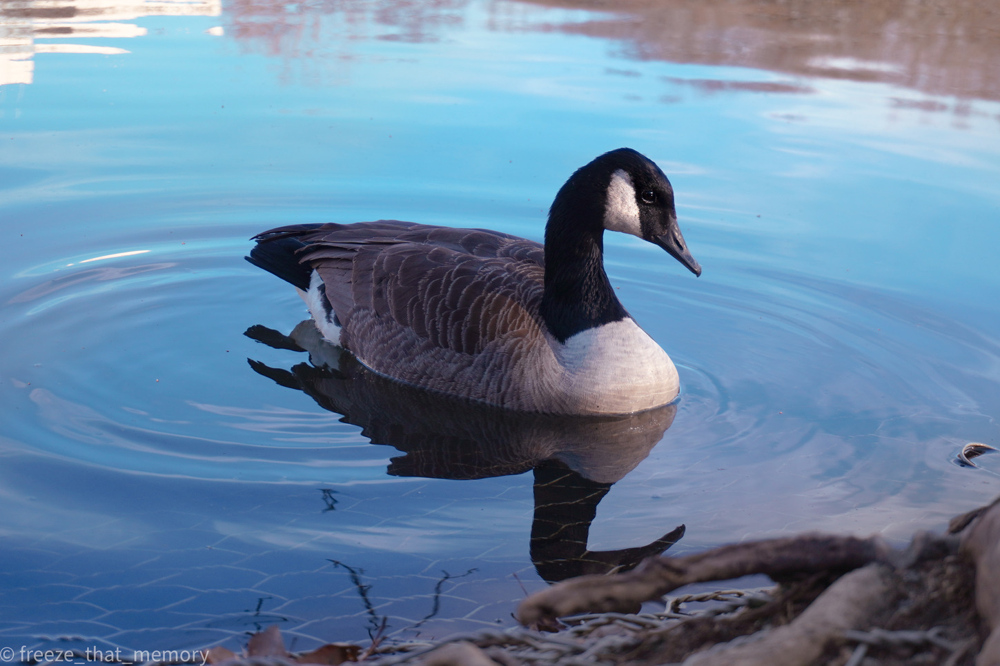

## IME: Image Manipulation and Enhancement 

###  Teammates
* Maria Anson - NUID 002931419
* Gugan Kathiresan - NUID 002756523

### Structure of Project
* Model
  * ImageManager
  * ImageManagerImpl
  * ImageMetaData
  * ImageMetaDataImpl 
  * HistogramMetaData
  * HistogramMetaDataImpl
  * ImageUtilInterface
  * ImageUtil
* Controller
  * InputCommandLine
  * InputCommandLineImpl
  * Command
  * commands (package)
    * One class for each type of manipulation possible in the program. This class implements
    * the Command interface.
* View
  * OutputLine
  * OutputLineImpl
  * ImageView
  * ImageViewImpl
* ProgramRunner

### Reasoning of structure
#### Model
_The model folder contains all the codes required for the image manipulation and enhancement._

1) ImageManager is an interface that has the required functions of the ImageManagerImpl model. 
2) ImageManagerImpl is a class that implements the interface ImageManager. The main functionality 
of 
this class is to store the different versions of manipulated images in the memory so that it can be
referred later for saving or further manipulation. 
3) ImageMetaData is an interface that has the required function of the ImageMetaDataImpl to store
the manipulated images in the memory. 
4) ImageMetaDataImpl is a class that represents the image in the program. The hashmap of the
   ImageManagerImpl contains the objects of this class. 
5) HistogramMetaData is an interface that has the required function of the HistogramMetaDataImpl
to store the histogram dataset in the memory. 
6) HistogramMetaDataImpl is a class that represents the histogram dataset in the program. The 
hashmap of ImageManagerImpl contains the objects of this class.
7) ImageUtilInterface is an interface that has the required function of the ImageUtil class.
8ImageUtil is a helper class has all the image manipulation
functions in the class, all the functions
are static so that it can be accessible without creating an instance.

#### Controller
_The controller folder contains all the codes that receives the input from the user and calls 
respective manipulation functions using the ImageManager from model._

1) InputCommandLine is an interface that has all the functions required for the controller class.
2) InputCommandLineImpl is a class which implements the InputCommandLine interface which is 
responsible for executing the user command or a script and also validates the input given by the
user.
3) Command is an interface that has the required methods to implement the command design pattern, 
with one driver function to facilitate the connection between the controller and the model.
4) The "commands" package is a package of classes that represent each of the valid commands
present in the current functionality of the model. Each class implements the Command interface.

#### View
_The view folder contains all the codes that prints all the feedback or output to the user._

1) OutputLine is an interface that has all the required functions.
2) OutputLineImpl implements the interface and print respective output to the user based on the
calls from both the controller and model.
3) The ImageView is an interface that has all the required methods to implement the GUI and
facilitate communication between the controller and view.
4) ImageViewImpl is a class that outlines the structure, actions and responses of the GUI.

#### Runner
ProgramRunner is one of the points of contact of the user, the other being running the program
through the jar file. The user can execute the main function of runner given the necessary
arguments to decide which type of execution is occurring. Specific arguments trigger the 
response of either command line inputs, script based running, or GUI operation.
This main function creates objects of the view and controller and executes 
them accordingly based on the functions defined above.

### JAR File Execution
The entire program can be executed using the JAR File. There are three types of execution, being
command line inputs, script based running, or GUI operation.
The steps are:
1) Open the folder containing the JAR File in command prompt.
2) For command line inputs type "java -jar NameOfFile.jar -text"
3) For script based input type "java -jar NameOfFile.jar -file /pathToScript"
4) For GUI operation simply type "java -jar NameOfFile.jar"
5) Additionally double-clicking on the jar file can trigger the operation of the GUI.

### Class Diagram

### Code Sequence
1. The use runs the jar file based on the instructions above.
2. a) Command Line Input - Enter your commands one by one. Type quit to stop execution.
b) Script Based - Allow time for the program to finish execution of your script till the 
completion message is returned.
c) GUI based input - employ the GUI to choose manipulations, view manipulation history,
access historical data, view histogram distribution of pixels, and view the current image. 
3. This triggers the execution of the main function of the ProgramRunner.java. 
4. An object of controller, and view will be created and send to the run function of controller. 
5. The input command is taken from the user when the run function of InputCommandLineImpl 
file is executed. 
6. The execute function of controller class is called. 
7. executeCommand or executeScript function is called based on the input if it's a command or run
   script.
8. A new instance of the class of the respective manipulation is created according to the
command design pattern.
9. The new object employs a driver function to facilitate the communication between the 
controller and the model. 
10. Within this driver function, the intended image manipulation is called 
using the ImageManager object which in turn uses the 
ImageUtil class. After the manipulation is done, the transformed image is stored to the hashmap of 
the ImageManager object. All the images are stored as ImageMetaData object in the hashmap. 
11. Similarly the distribution of pixel values is stored as a dataset in the HistrogramMetaData
object in the other hashmap. 
12. In command line and script based execution, the feedback or output to the user 
is displayed in the command prompt using the OutputLine object.
13. For GUI operations, the user can view the updated histogram distribution and image
as the manipulation is executed. All feedback or output is provided to the user through the
GUI and its prompts. The user can additionally view the manipulation history and access 
previously manipulated images to pick up wherever they like.

### Citation

Canada Goose at Leverett Pond, Boston

Photograph owned by Maria Anson

